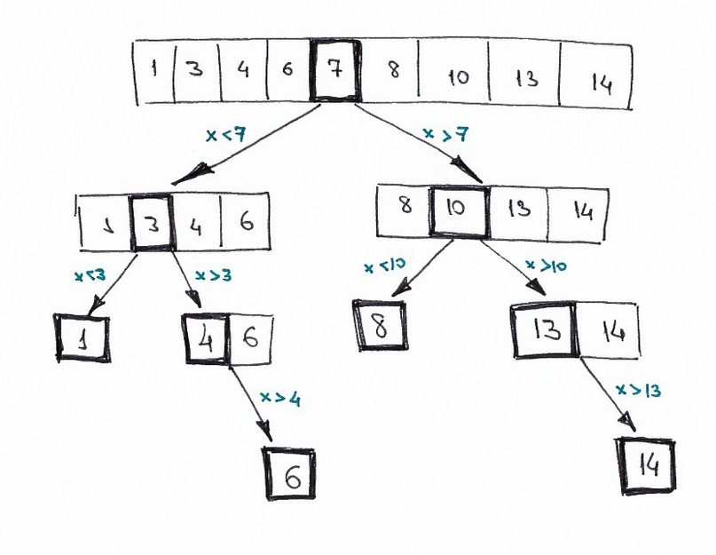

# Двоичный поиск

Двоичный поиск — классический алгоритм поиска элемента в отсортированном массиве, использующий дробление массива на половины. Используется в информатике, вычислительной математике и математическом программировании.

Худшее время - O(log2n)

Лучшее время - O(1)

Среднее время - O(log2n)

Затраты памяти - O(1)
