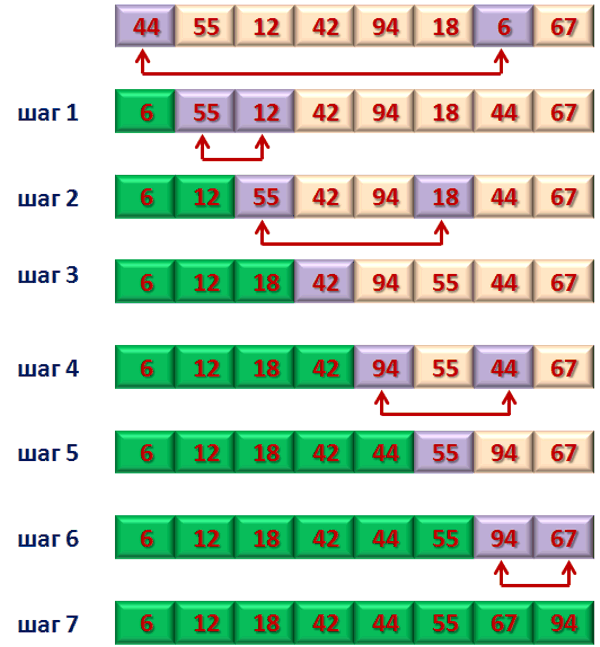

# Сортировка выбором

Сортировка выбором —  алгоритм сортировки. Может быть как устойчивый, так и неустойчивый. На массиве из n
элементов имеет время выполнения в худшем, среднем и лучшем случае O(n2), предполагая что сравнения делаются за постоянное время.

Худшее время - O(n2)

Лучшее время - O(n2)

Среднее время - O(n2)

Затраты памяти - O(1)

### Пример работы алгоритма

